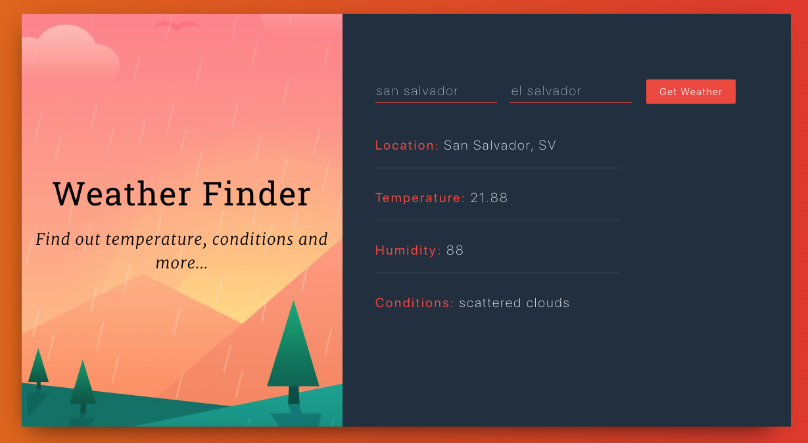

# WEATHER-APP

> `Code Along` exercise for creating a simple REACT application from scratch using the `create-react-app` script.

## Table of contents
* [General info](#general-info)
* [Screenshots](#screenshots)
* [Technologies](#technologies)
* [Setup](#setup)
* [Features](#features)
* [Status](#status)
* [Contact](#contact)

## General info
The purpose of the project is to build an interface to fetch data from an external weather API and render it to screen using REACT. [development-strategy.md](./development-strategy.md) file contains the steps used to complete this project, it describes the branches with details about the what is implemented.

## Screenshots

## Technologies

* Javascript
* REACT
* Bootstrap

## Setup
You can clone or fork this repository and test the files.

## Features
The project features a web site with:
* User can fetch information about the weather of the location provided in the input fields city and country.

## Status
Project is: finished, final version.

## Contact
Created by [@ferrycosv](www.github.com/ferrycosv) - feel free to contact me!